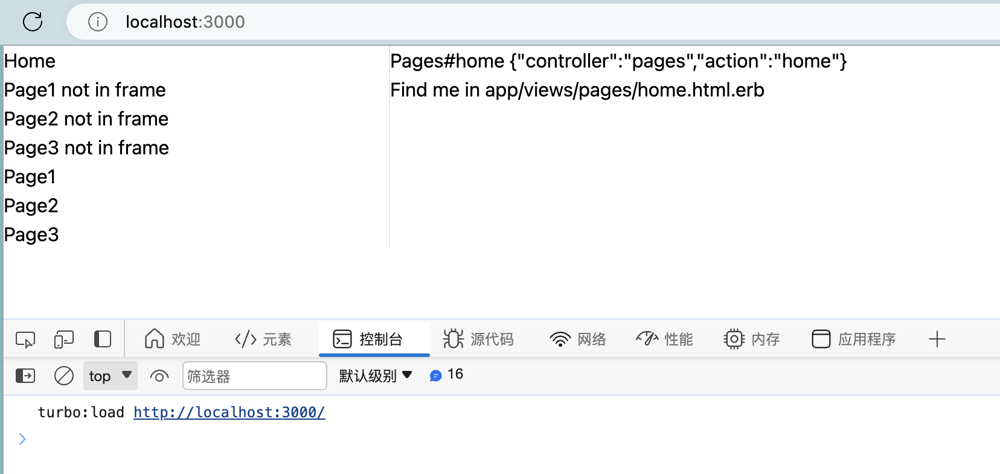

# README

how to repro this issue:

```
bin/dev
```

- open `http://localhost:3000/` in browser
- open browser inspector and check the console output
- click link `Page1 not in frame`, `Page2 not in frame` and `Page3 not in frame`, `turbo:before-cache` is caching previous page
- click link `Page1 in frame`, `Page2 in frame` and `Page3 in frame`, `turbo:before-cache` is caching current page

## screenshots

### open http://localhost:3000/


### click `Page1 not in frame`


### click `Page1`


